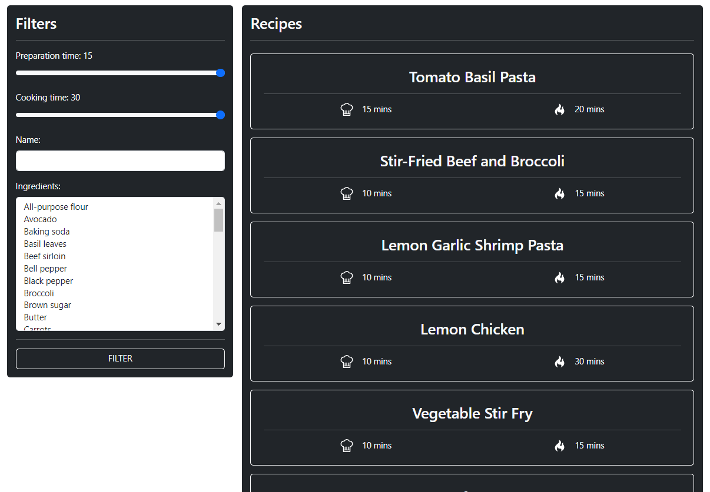

# TP - Site de Recettes 
### Objectif
Appréhender et comprendre le but des interfaces en Typescript 

### Sujet
Via l'utilisation d'interfaces, vous réaliserez un site internet permettant de consulter des recettes de cuisine. Ces recettes seront récupérées depuis un fichier : `recipes.js` dont la structure est semblable à un BSON de base de données MongoDB. 

Vous devrez exploiter les données et pouvoir les trier dans le but de les afficher sur votre site web.

Les options de tri seront les suivantes :
- Filtre par temps de préparation
- Filtre par temps de cuisson
- Filtre par ingrédients (on pourra sélectionner plusieurs ingrédients et les recettes affichées seront celles contenant au moins les ingrédients sélectionnés)
- Filtre par nom (le début du nom de la recette devra être l'input utilisateur)

Pour ce faire, vous aurez besoin d'une interface de ce type : 

```ts
interface Recipe {
  id?: string;
  name: string;
  servings: number;
  prepTime: string;
  cookTime: string;
  ingredients: {
    name: string;
    amount: string;
  }[];
  instructions: string[];
}
```

Vous aurez également besoin de traiter les données dans l'application sous forme d'Array. Pour ce faire, il vous faudra donc créer une variable de ce type : 

```ts
const recipesList: Recipe[] = [];
```

Enfin, dans le but de transformer l'objet Javascript en un Array exploitable, la méthode la plus simple sera de parcourir chaque clé de l'objet exporté (avec par exemple une boucle de type `for (const el in containerVar) { }`).

---

